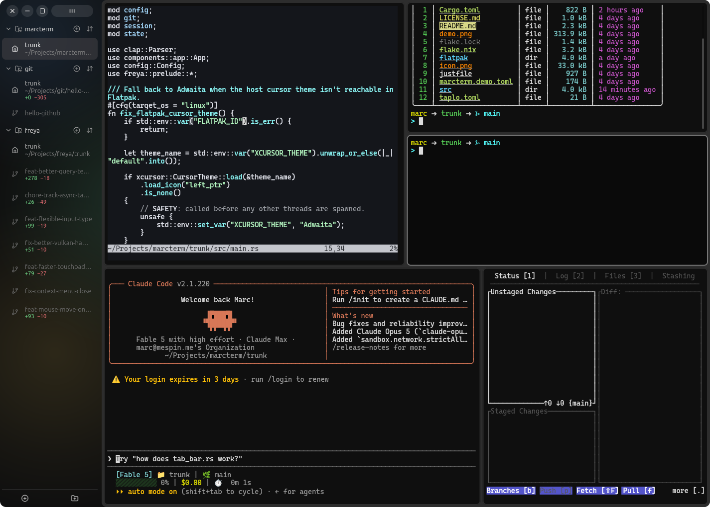

<p align="center">
  
</p>

<h1 align="center">marcterm 🖥️</h1>

<p align="center">
  Terminal emulator built with <a href="https://github.com/marc2332/freya">Freya</a> and Rust 🦀
</p>

---

> [!NOTE]
> marcterm is designed around my own usage and setup, so it might behave in unexpected ways on other setups.



---

## 📦 Installation

### Flatpak (Linux)

Install:
```sh
flatpak remote-add --if-not-exists flathub https://dl.flathub.org/repo/flathub.flatpakrepo
flatpak remote-add --if-not-exists --no-gpg-verify --user marcterm https://marc2332.github.io/term
flatpak install --user marcterm io.marc.term
```
Update:
```sh
flatpak update io.marc.term
```

### Cargo

```sh
cargo install --git https://github.com/marc2332/term
```

## ✨ Features

- 🗂️ **Tabs** — open and manage multiple terminal sessions
- 🌿 **Git worktrees** — every worktree is listed under its project with live diff stats, mostly designed around how [marcgit](https://github.com/marc2332/git) works
- ➗ **Panel splitting** — split any panel horizontally or vertically
- ↔️ **Resizable panes** — drag to resize split panels
- 📌 **Collapsible sidebar** — toggle between full and compact icon-only sidebar
- 🔡 **Adjustable font size** — change at runtime with a keyboard shortcut

## ⌨️ Keybindings

### Tabs

| Linux / Windows | macOS | Action |
|---|---|---|
| `Ctrl+Shift+T` | `Cmd+T` | New tab |
| `Ctrl+Shift+W` | `Cmd+W` | Close active tab |
| `Ctrl+Tab` | `Ctrl+Tab` | Next tab |
| `Ctrl+Shift+Tab` | `Ctrl+Shift+Tab` | Previous tab |

### Panels

| Linux / Windows | macOS | Action |
|---|---|---|
| `Alt+P` | `Option+P` | Split panel vertically (top/bottom) |
| `Alt++ / Alt+=` | `Option++ / Option+=` | Split panel horizontally (left/right) |
| `Alt+-` | `Option+-` | Close active panel |
| `Alt+1` | `Option+1` | Close all panels except active |
| `Alt+←` | `Option+←` | Focus panel to the left |
| `Alt+→` | `Option+→` | Focus panel to the right |
| `Alt+↑` | `Option+↑` | Focus panel above |
| `Alt+↓` | `Option+↓` | Focus panel below |

### General

| Linux / Windows | macOS | Action |
|---|---|---|
| `Alt+B` | `Option+B` | Toggle sidebar (expanded / collapsed) |
| `Ctrl++ / Ctrl+=` | `Cmd++ / Cmd+=` | Increase font size |
| `Ctrl+-` | `Cmd+-` | Decrease font size |
| `Ctrl+Shift+C` | `Cmd+C` | Copy selected text |
| `Ctrl+Shift+V` | `Cmd+V` | Paste from clipboard |

## ⚙️ Configuration

marcterm reads its config from `~/.config/marcterm.toml`.

```toml
# Shell binary to launch.
shell = "bash"

# Font size in logical pixels.
font_size = 14.0

# Font family used by the terminal. Uses freya's default when not set.
# font_family = "Cascadia Code"
```

Copy the bundled `marcterm.demo.toml` as a starting point:

```sh
cp marcterm.demo.toml ~/.config/marcterm.toml
```

## 🔨 Building from source

```sh
cargo build --release
```

The compiled binary will be at `target/release/marcterm`.

## 📄 License

This project is open source. See [LICENSE](LICENSE) for details.
